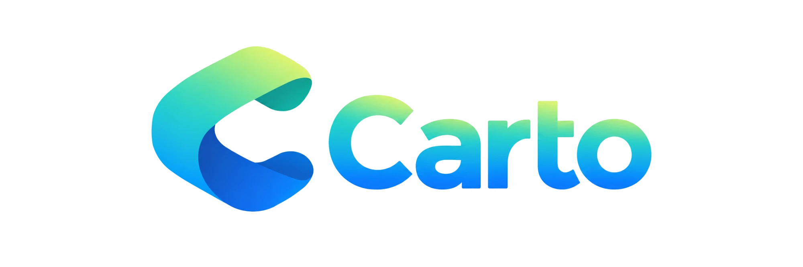
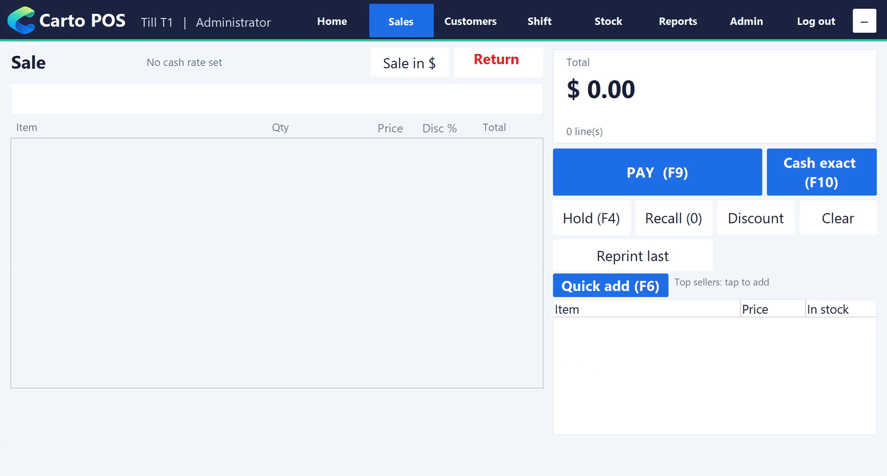
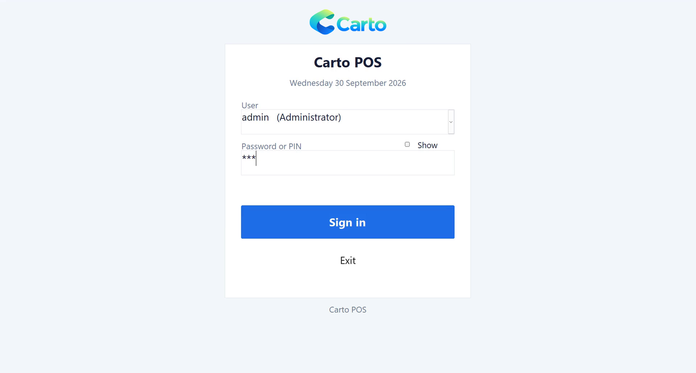
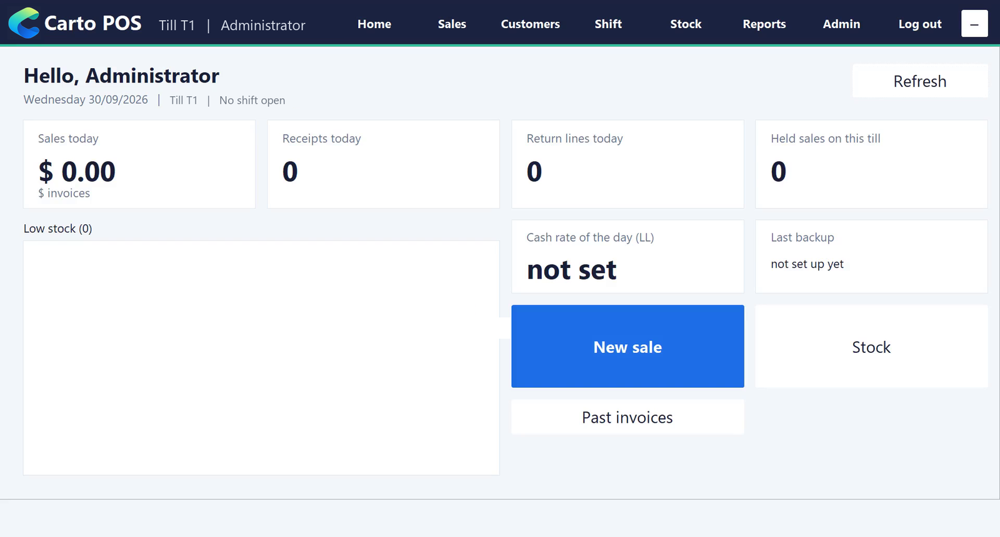
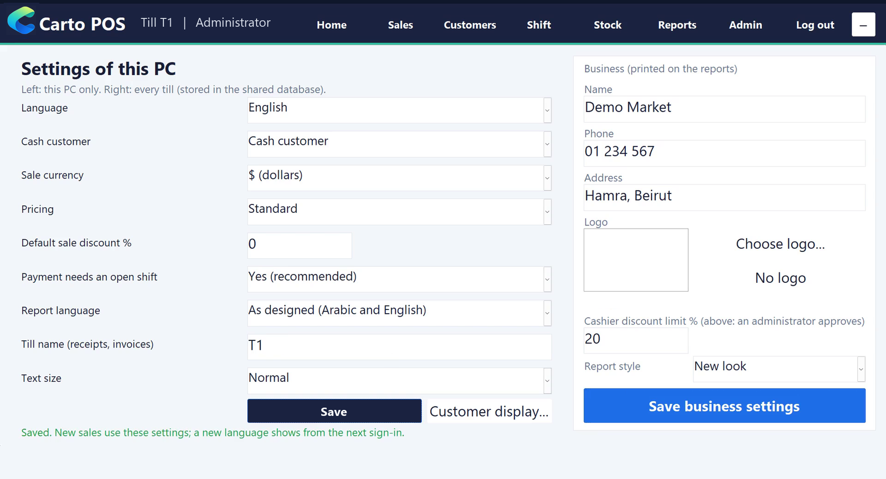
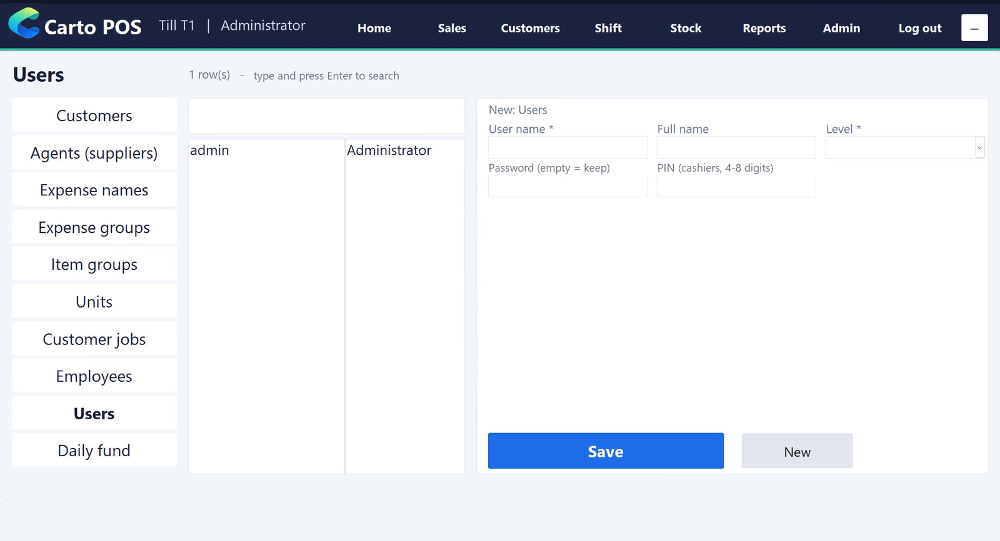
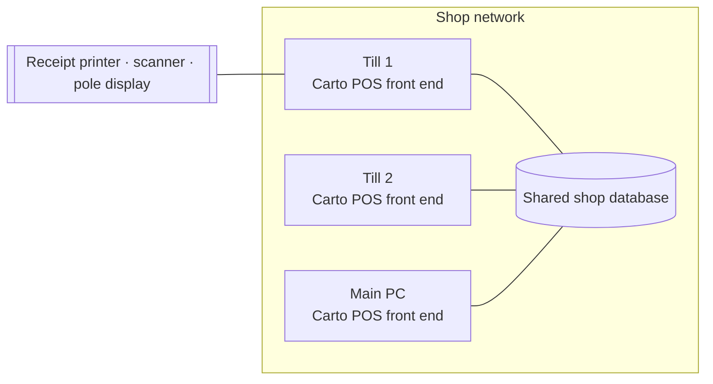

  

<h1 align="center">Carto POS</h1>

  <b>A commercial point-of-sale and back-office system for retail shops in Lebanon.</b> 
  Co-developed and sold with my father · in production since 2020 · used by around 30 shops

  
  
  
  

  

> This repository is a **showcase**: screenshots, architecture and engineering notes.
> The source code is commercial and not published here. All screenshots come from a demo shop with no customer data.

---

## What it does

Carto POS runs the daily work of a shop: the tills at the counter and the office behind them.

| Area | Features |
|---|---|
| **Sales** | Barcode scanning, live item search, returns as negative lines, hold / recall, quick-add buttons, one-key "cash exact" payment |
| **Payments** | Cash and cheque; money in and change in **US dollars and Lebanese pounds** with a daily exchange rate; split payments |
| **Cash control** | Shifts with opening float, pay-in / pay-out, X and Z reports |
| **Customers** | Accounts, invoices with several receipts each, payments on account, statements, predefined discounts |
| **Stock** | Items, groups, units, stock counts, low-stock alerts, own EAN-13 barcodes, printed labels |
| **Back office** | Suppliers and purchase invoices, receipt vouchers, expenses, payroll and attendance |
| **Reports** | ~30 reports (sales, profit, stock, customers, purchases, expenses, payroll), preview, print, PDF |
| **Hardware** | Receipt printers, barcode scanners, customer pole displays over a COM port (ESC/POS, CD5220, LED) |
| **Languages** | Every screen in **English or Arabic** with right-to-left layout; reports in English, Arabic or as designed |

The largest installation has processed **hundreds of thousands of invoice lines**.

## Screenshots

| | |
|---|---|
|  |  |
| **Login**: password or cashier PIN, attempt limits | **Dashboard**: today's sales, receipts, returns, rate, low stock |
|  |  |
| **Settings**: per-till and shop-wide, discount limit | **Lists**: users, customers, suppliers, employees… |

## Architecture

A classic split Microsoft Access application: one front end per till, one shared database per shop, on the shop's local network.

| Layer | Technology |
|---|---|
| Screens, business logic | VBA modules (cart, pricing, payments, stock, shifts, invoices, reports, languages…) |
| Data | Access / ACE SQL, DAO, transactions, versioned schema |
| Build and tests | PowerShell driving Access over COM; Python for dependency analysis |
| Installer | C# (.NET) desktop setup tool |

## Engineering highlights

In 2026 I led a modernisation of the product. It started with an audit of the running system. These are the problems it found and how they were solved.

### Two tills, one receipt number
Two tills could finish a sale at the same moment and both get the same receipt number. A customer reported this as "two invoices with the same ID".
- Receipts are now numbered, closed and paid **in a single transaction under a cross-till lock**. Printing happens only after the commit.
- Each till sells into its **own daily invoice**. Only one till at a time can sell into a customer's invoice.
- **Stress test:** two tills selling in parallel → **600 of 600 receipts unique**, stock totals exact.

### Stock that is never counted twice
Stock was updated without transactions, so a crash in the middle of a sale could leave it wrong.
- Each line now moves stock in one transaction, with an **"applied quantity" marker**, so a retried or edited line is never counted twice.
- A sale cannot take stock below zero. The cashier is told when the item is scanned, not at payment.

### Security
- Plain-text passwords became **salted PBKDF2-SHA256 hashes**.
- Login attempt limits and per-user roles. Cashiers only see Sales, Shift and Log out.
- Discounts above a shop-wide limit need an **administrator's approval on the till**.
- Every login, change and deletion is written to an **audit log**.

### Safe upgrades of live customer data
- A **versioned, idempotent schema upgrade** takes a verified backup first and can roll back.
- Tested on copies of real databases: the data fingerprint is unchanged, and a second run does nothing.

### Built from source, tested automatically
Access applications are normally edited by hand inside a binary file. Here everything is **built from text**:
- forms, queries and VBA modules live as text files;
- PowerShell scripts generate the database, install the new UI, brand the reports and check that it compiles.

On top of that:
- **Dependency analysis** removed unreachable objects (201 forms, 350 queries, 100 reports): the app went from **67 MB → 27 MB**.
- **About a dozen automated test suites** run against throw-away copies:
  - unit tests (45/45) and failure-injection tests (16/16);
  - a multi-till stress test;
  - every report opened automatically;
  - a **golden test** against the legacy app's customer statements: 345/348 identical, and the 3 differences are a bug in the old version;
  - a replay of a real customer's receipts against the new pricing code.

### A new touch UI on Microsoft Access
- One shell window with a resize engine (1024×768 to 1920×1080), a theme and touch-sized buttons.
- Arabic / English switching with right-to-left layout.
- The Access window is hidden, so users only see Carto POS.
- Restyled reports with a preview bar (print, quick print, PDF, zoom).
- EAN-13 barcodes and Code 128 labels drawn directly, with no barcode font needed.

## Who did what

- **2020 → today: the product.** My father and I built and sold Carto POS. I developed sales, reporting and user-management features in MS Access, SQL and VBA.
- **2026: the modernisation.** I led it and used **Claude Code (an AI coding agent) as a pair programmer**:
  - My part was the requirements, every business-rule decision (money, stock, receipts, user rights) and the test plans. I reviewed the changes and accepted the work.
  - A large share of the new code was written in those AI sessions.
  - The project rules kept customer data on copies only and called for automated tests before any change was accepted.

## Status

| | |
|---|---|
| Classic Carto POS | **Live** in around 30 shops since 2020 |
| Modernised release (new UI, security, multi-till) | **Built and tested** on copies of real customer data. Rollout to the first customer is next. |
| Next generation | Early planning of a Kotlin / Spring Boot + PostgreSQL + Flutter platform, see [inventory-playground](https://github.com/Amir-Merchad/inventory-playground) |

---

  <b>Amir Merchad</b> · Computer Science, TU Dortmund ·
  <a href="https://github.com/Amir-Merchad">GitHub</a> ·
  <a href="https://www.linkedin.com/in/amir-merchad-9ab916320">LinkedIn</a> ·
  <a href="mailto:amirmerchad@gmail.com">amirmerchad@gmail.com</a>

© Amir Merchad. Carto POS is commercial software; the images and text in this repository may not be reused without permission.
